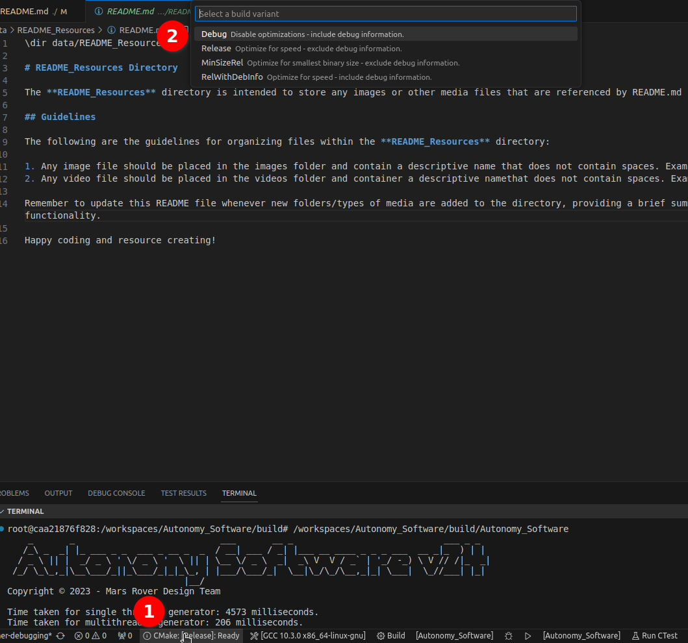
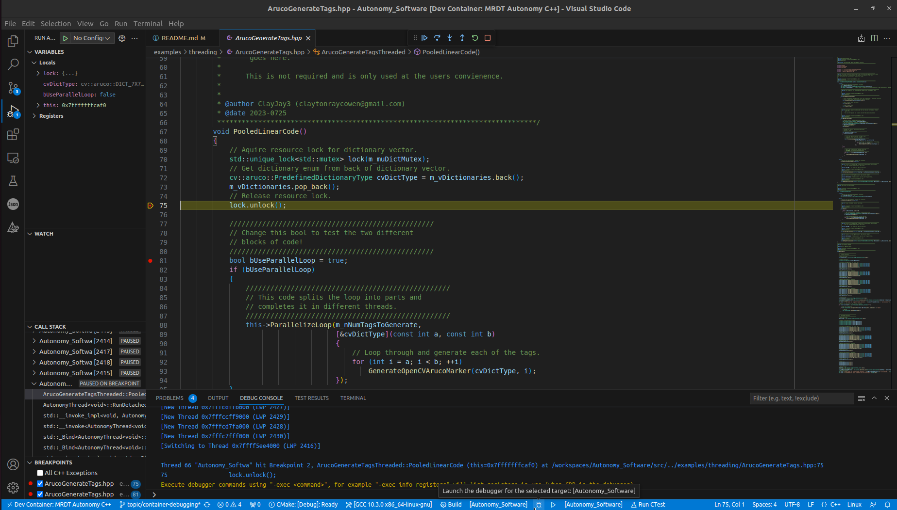
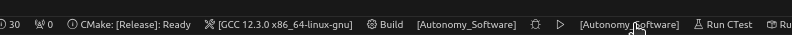
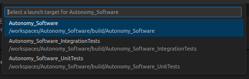
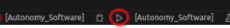
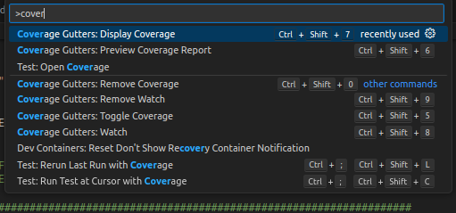
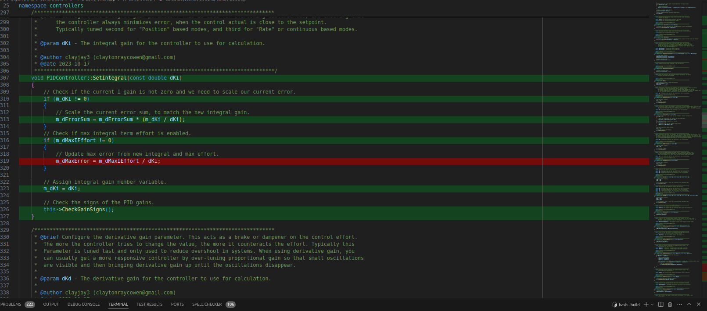

\page md_DEBUG Development Guide

# 🎯 Debugging with CMake and Visual Studio Code

Hey there, C++ developer! Ready to dive into debugging your code like a pro? Let’s make this process smooth and (dare I say) fun with CMake and Visual Studio Code. No stress—just follow along, and you’ll be debugging in no time!

## 🚀 Quick Setup Guide

1. **Open Your Project in a Devcontainer**  
   First things first: grab the _Dev Containers_ extension from the VSCode marketplace. Done? Awesome! Now hit `CTRL + SHIFT + P`, search for `Dev Container: Rebuild Container`, and voilà—you’re good to go!

2. **Pick Your CMake Kit**  
   Don’t worry; VSCode has your back! When you first open the project, it’ll ask you to select a C++ toolchain (aka a CMake Kit).  
   Pro tip: Choose `/usr/bin/g++` or `/usr/bin/gcc`—these are your go-to safe options!

   |  | 
   |:--:| 
   | *Kit selection? Easy. Stick to `/usr/bin/g++` or `/usr/bin/gcc`.* |

3. **Configure and Build Like a Pro**  
   CMake will automatically configure things as needed. All you have to do is sit back, grab a coffee, and let it work its magic. Once that’s done, use the toolbar buttons to build and run your shiny new software.

   |  | 
   |:--:| 
   | *Toolbar = your best friend for building and running.* |

## 🛠️ Time to Debug!

Now that you’re all set up, let’s get cracking on debugging your C++ code. Ready? Let’s go!

1. **Set Some Breakpoints**  
   Want to pause your program and take a peek at what’s happening under the hood? Just click next to the line number, and bam—you’ve got yourself a breakpoint!

   |  | 
   |:--:| 
   | *Look for the red dot to set breakpoints like a boss.* |

2. **Switch to Debug Mode**  
   Debugging mode is your playground, but first, let’s compile your code with debug flags. Use the bottom toolbar to flip from Release to Debug mode. Remember: Debug is for squashing bugs, Release is for speed!

   |  | 
   |:--:| 
   | *Flip that switch to Debug mode when hunting bugs.* |

3. **Start Debugging**  
   It’s showtime! Click the debug icon in the toolbar, and watch as VSCode does all the heavy lifting—building and launching your code in debug mode.

   |  | 
   |:--:| 
   | *Hit that debug button and let's get cracking!* |

4. **Master the Debugging Controls**  
   Now the fun begins! Use the controls to step into, step over, and continue through your code. It’s like navigating through a choose-your-own-adventure book, except you get to catch bugs and optimize performance!

   

   - **Variables View**: Curious what’s going on inside your variables? Peek into the "Variables" view—it's like X-ray vision for your code.
   - **Call Stack View**: Wondering how you got here? The "Call Stack" is your map of all the function calls that led you to this point.
   - **Watchpoints**: Set a watchpoint and see exactly when a variable changes. It’s like having a detective on your code.
   - **Debug Console**: Need to test something on the fly? Jump into the Debug Console and run expressions like a wizard casting spells. 🧙‍♂️

## ✅ Writing, Running, and Viewing Tests  

Testing is a crucial part of development. In this section, you'll use **CTest**, **lcov**, and **gcovr** to ensure your code works perfectly. With the **Coverage Gutters** extension in VSCode, you can even visualize code coverage right in your editor!

1. **Enable Test and Coverage Modes**  
    Update your CMake configuration to include the following options:

    ```cmake
    # Enable or Disable Code Coverage Mode
    option(BUILD_CODE_COVERAGE "Enable Code Coverage Mode" ON)

    # Enable or Disable Tests Mode
    option(BUILD_TESTS_MODE "Enable Tests Mode" ON)
    ```

    These flags ensure your project builds with test and coverage instrumentation.

2. **Write and Configure Your Tests**  
    Add test cases using the Google Test framework. Any new tests added should automatically be picked up by CMake.

3. **Build and Run Your Tests**  
    Click the **Build** button in VSCode to configure and build the project. This process will also build and run all tests if `BUILD_TESTS_MODE` is enabled. To run tests manually, execute:

    ```bash
    cd build
    ./Autonomy_Software_UnitTests
    ./Autonomy_Software_IntegrationTests
    ```
    Or run tests through the bottom toolbar:

    |  | 
    |:--:| 
    | *Click to change the run target.* |

    |  | 
    |:--:| 
    | *Select your run target. (Unit or Integration tests)* |

    |  | 
    |:--:| 
    | *Run your tests with the play button in the bottom toolbar.* |

4. **Generate Code Coverage Reports**  
    If `BUILD_CODE_COVERAGE` is enabled, **lcov** and **gcovr** will be used to collect and visualize coverage data. The Autonomy_Software project can run the necessary commands to do this for you:

    ```bash
    cd build
    make run_coverage
    ```

    Then, you can display test coverage of files from directly within the VSCode editor. Hit `CNTL+SHIFT+P`, and select the `Coverage Gutters: Display Coverage`:
    
    
    When you open files that should be covered by a test, you will see **<span style="color:green">GREEN</span>** highlights for lines that are executed during a test, and **<span style="color:red">RED</span>** highlights for lines that are currently untested:
    
---

## 🏁 Wrap-Up  

Debugging, testing, and ensuring code coverage doesn’t have to be painful. With CMake, CTest, lcov, and gcovr (plus the power of VSCode), you’ve got everything you need to catch bugs and write rock-solid code.

Happy debugging and testing! 🎉
