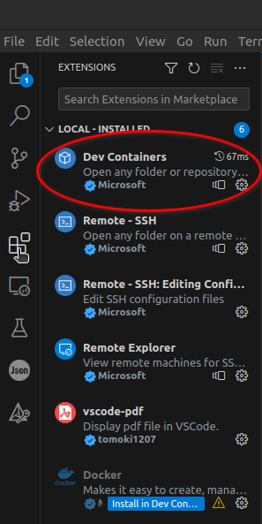

\page md_INSTALL Installation Guide

# 🛠️ Installing Autonomy Software

Welcome aboard, developer! Ready to get your Autonomy Software environment set up? Follow along, and we’ll get everything installed in no time! Let’s jump in. 🚀

---

### 1. 📥 Download and Install the Essentials

Before we start coding, let’s grab some tools to set up our environment. You’ll need:

- 🖥️ **Visual Studio Code** – Download it [here](https://code.visualstudio.com/download).  
- 🧰 **Git SCM** – Download it [here](https://git-scm.com/downloads).  
- 🐋 **Docker** – Download it [here](https://docs.docker.com/engine/install/).  
  _Important_: If you're on Windows, install **Docker Desktop**. For other OSs, go with **Docker Engine**.

_Optional_ but highly recommended for those with NVIDIA GPUs:

- 🖼️ **NVIDIA Container Toolkit** – Download it [here](https://docs.nvidia.com/datacenter/cloud-native/container-toolkit/latest/install-guide.html).  

_Windows users_, you’ll want to integrate **WSL** (Windows Subsystem for Linux) into your Docker install. [Check this guide](https://medium.com/htc-research-engineering-blog/nvidia-docker-on-wsl2-f891dfe34ab) for some tips.

🎯 **Pro Tip:** For all installs, select the _Add to PATH_ options whenever available. It’ll save you headaches later!

---

### 2. 🧩 Open VSCode and Install Extensions

Now that VSCode is installed, let’s power it up with some extensions!

- Go to the extensions tab (the little square icon on the left toolbar) and search for `Dev Containers`.
- Click the install button to add it to your toolkit.



**Note:** Once we’re in the devcontainer, the extensions you install locally will be separate from the ones inside the container. Want a particular extension to be included by default? Hit up one of our [software leads](https://github.com/orgs/MissouriMRDT/teams/software_leads).

---

### 3. 🧑‍💻 Clone the Autonomy_Software Repo

Let’s grab the code!

1. Hit `CTRL + SHIFT + P` to open the command palette.
2. Start typing `git clone`, then select `Git: Clone (Recursive)` from the list.
3. Paste in this URL:  
   ```https://github.com/MissouriMRDT/Autonomy_Software.git```
4. Choose where to save the repo on your local machine—organize it so it’s easy to find later!
5. Once the cloning is done, VSCode will ask if you want to open the new workspace. Click _Open_.

---

### 4. 🐳 Open the Repo Inside the Devcontainer

Now comes the fun part: working inside our devcontainer, which is basically a fully-loaded environment ready to go. All the packages, libraries, and tools you need are baked right into the image!

- When you first open the repo, VSCode should prompt you to open it in a devcontainer. Go ahead and click _Open_.
- If that prompt doesn’t appear, no worries! Hit `CTRL + SHIFT + P` again, type `Dev Containers: Rebuild Container`, and select that option.

Now give it some time to spin up the container—when the logs in the OUTPUT window stop printing, you’re good to go!

---

### 5. 🚦 First Build and Run

You’re so close now! Let’s get your first build running:

1. Once the devcontainer is up, a box will pop up asking which CMake Kit you want to use. Choose the one pointing to `/usr/bin/g++` and `/usr/bin/gcc`.
   
   
   
2. CMake will auto-configure the project if needed. This might take a few seconds depending on your machine. When it’s ready, use the toolbar buttons to build, run, or debug your code with ease!

   
   
3. You can also perform standard `make` commands by navigating to the `build/` directory with `cd build/`, and running your desired commands.

---

### 6. 🔍 Explore the Codebase

Now that everything’s set up, feel free to roam around the directories. Get a feel for the structure and what’s inside each folder.

---

### 7. 📖 Check the README Files

Inside each directory, you’ll find README files with detailed guidelines. These are your go-to docs for understanding how to organize files and use the functionalities.

---

### 8. 🛠️ Start Developing!

That’s it! You’re ready to start coding, debugging, and making the Autonomy Software even better. Happy coding! 🎉
